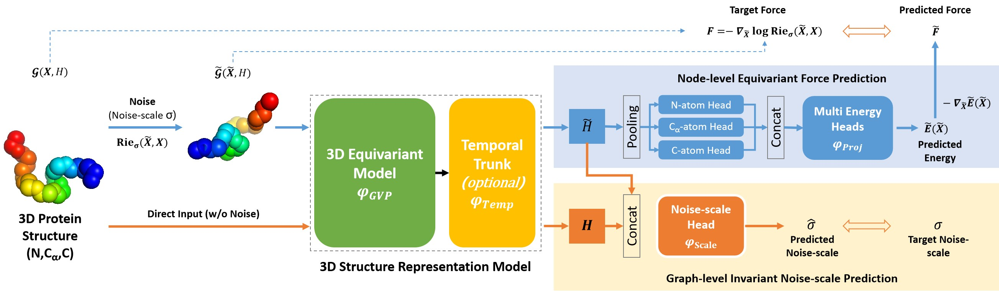

# Energy-Motivated Unsupervised Pretraining for Equivariant Protein Structure Graphs



This is a toy respository for pretraining **3D Protein Structure Model** based on energy-motivated function.


This open code is directly inspirated by this [repo](https://github.com/jiaor17/3D-EMGP), *Energy-Motivated Equivariant Pretraining for 3D Molecular Graphs*.

The main difference between a *protein* node and a *molecular* node: a *protein* node usually represents a residue with N atomatic coorfinates and its shape={N,d}; and a molecular node only represents a atom coordinates with shape=(,d),

where d=3 here denotes the (x,y,z) coordinates and N is usuualy set as 3 (N,Ca,C) or 4 (N,Ca,C,O).


The GVP backbone is sourced from this [repo](https://github.com/drorlab/gvp-pytorch) *Geometric Vector Perceptron*.

<!-- For more details, please refer to the introduction of our methods (.pdf file). -->


## Requirements
Download this repository and run `python setup.py` develop or `pip install . -e`. Be sure to manually install `torch_geometric` first.

### Dependencies
```
python==3.6.13
torch==1.8.1
torch_geometric==1.7.0
torch_scatter==2.0.6
torch_cluster==1.5.9
tqdm==4.38.0
numpy==1.19.4
sklearn==0.24.1
atom3d==0.2.1
```

### Dataset
Run [getCATH.sh](./data/getCATH.sh) in [data/](data/) to fetch the CATH 4.2 dataset, which is used the training set.


## Pretraining
To run the pretraining pipline via the following commands.
```bash
export CUDA_VISIBLE_DEVICES=0
python run_energy_training.py --models-dir ./out_model/energy_train --max-nodes 5000

```
For more parameters, you can run `python run_energy_training.py -h`


## TODO List
- [ ] To validate the pretrained model on downstream tasks.
- [ ] Release the GVP-Transformer version (This version only include GVP module).
- [ ] Pretrain peotein structure using more backbones.

